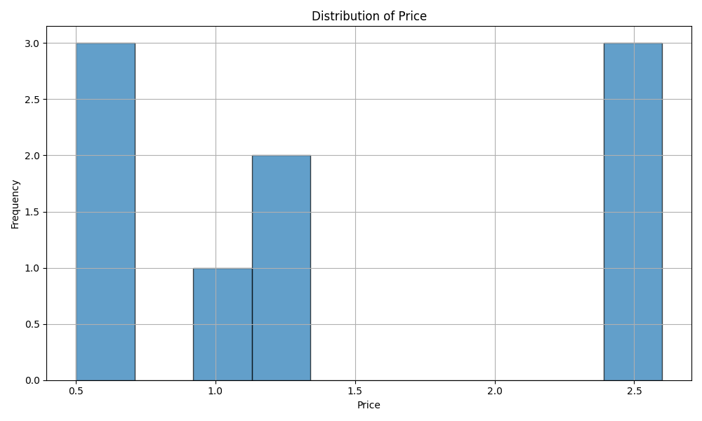

# IDS706_MiniProj2_YangXu

This repository is a continuation of the IDS706 course assignments, focusing on Mini Project 2. Building upon the foundational [ids706-python-template](https://github.com/xuy50/ids706-python-template), it modifies and introduces Pandas-based descriptive statistics.

## Overview

Utilizing the Pandas library, this project demonstrates essential techniques for statistical analysis on datasets. 

## Key Modifications from Original Template

- Transformed `mean.py` to exhibit a sample Pandas descriptive statistics script.
- Adjusted `test_main.py` to reflect changes introduced in `mean.py`.
- Integrated `pandas 2.1.0` within `requirements.txt` to facilitate data manipulation and statistical functions.

### Requirements

Ensure the presence of:
- Python (Version 3.6 or newer)
- Pandas (Version 2.1.0)

## Data Visualization

